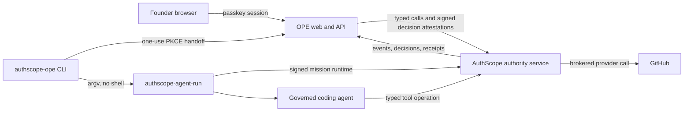

# AuthScope OPE Edition v1 Design

**Status:** Approved product direction, ready for implementation planning
**Date:** 2026-09-13
**Repository:** `github.com/tauliang/auth-scope-ope`

## 1. Decision summary

AuthScope OPE Edition will be a thin founder-facing product layer over the existing AuthScope authority service. It will not fork, copy, or reimplement mission evaluation, execution grants, policy decisions, credential brokering, revocation, or signed execution evidence. OPE verifies local founder proof and signs only the exact decision attestations AuthScope independently checks.

The v1 product promise is:

> One GitHub issue becomes one expiring Mission Pass, one governed agent run, one pull request, and one verified receipt.

The first target user is a technical solo founder who already runs a supported coding agent and wants that agent to work unattended without granting broad, standing GitHub authority.

## 2. Problem

An OPE can start more AI workers than one person can supervise. The founder becomes the only owner, approver, security operator, finance controller, and incident responder. Existing agent permission prompts either grant reusable technical access or interrupt the founder for individual tool calls. Neither approach expresses the business purpose, total consequences, expiry, or evidence expected from a complete mission.

AuthScope OPE Edition will convert founder intent into a reviewable Mission Pass, keep the pass bound to AuthScope's enforced mission, and present only material exceptions and verified outcomes.

## 3. Goals

1. Let a first-time founder go from the first product-controlled interaction through a launched governed run in under five minutes, excluding only time spent on GitHub-hosted authentication and App-installation screens.
2. Give in-scope work a fast path while requiring an exact, expiring decision for requested authority expansion.
3. Keep GitHub provider credentials and reusable AuthScope bearer credentials out of OPE application logic, the browser, agent process, command line, logs, analytics, and OPE database. AuthScope performs every GitHub read and write through its credential broker; OPE reaches AuthScope through a workspace-bound, non-exportable workload identity with the `decision_attestor` role.
4. Display AuthScope decisions and receipts without creating a second policy engine or rewriting authoritative outcomes.
5. Make revocation visible and effective for the next governed action within ten seconds.
6. Produce a private founder receipt and a privacy-filtered GitHub check within sixty seconds of upstream completion.
7. State enforcement honestly as `observed`, `checked`, or `enforced` for every connected surface.

The north-star product metric is **evidence-backed missions completed without unplanned founder intervention per active founder per week**.

Within Task 1, after an immutable upstream contract passes the complete capability gate and before Task 2 begins, five first-time users must complete a contract-faithful click-through from the first product-controlled interaction to a simulated confirmed `RunID`. Median time must be under five minutes. A miss requires revising and rerunning the flow before Task 2 begins.

## 4. Non-goals for v1

- Task queues, scheduling, chat, memory, project management, or agent routing.
- Multiple founders, team invitations, RBAC, SSO, SCIM, billing, or compliance exports.
- GitLab, Bitbucket, local-only repositories, or non-coding missions.
- Agent marketplaces, agent selection, swarm visualization, or parallel mission coordination.
- Custom policy languages, arbitrary authority editing, permanent grants, or automatic authority expansion.
- Direct default-branch writes, automatic merge, release, deployment, issue closure, repository administration, workflow-file changes, or secrets management.
- A generic GitHub REST, GraphQL, HTTP, or shell-command proxy.
- Public receipt profiles, discoverable badges, feeds, or public sharing links.
- Claims that a signed receipt proves a business decision was correct, lawful, or compliant.

## 5. User experience

The web product has three screens.

### 5.1 Connect

Before serving the bootstrap UI, instance initialization durably binds the local store to exactly one configured AuthScope workspace, hostname, origin, RP ID, instance ID, and cookie name. AuthScope then authenticates the non-exportable workspace workload identity, verifies its `decision_attestor` role and workspace, and OPE attaches that identity digest once. The founder unlocks the ready instance with a passkey, installs or selects the AuthScope GitHub App for one repository, and verifies that AuthScope reports the required runtime and GitHub enforcement capabilities. Personal and business activity use separate OPE instances, hostnames, data directories, and workload identities in v1; the UI does not switch workspaces.

GitHub connection is a three-step handoff. OPE begins the handoff and sends the browser to an AuthScope-hosted App-installation flow. AuthScope redirects to OPE with only opaque, one-use AuthScope binding code and state values; no GitHub OAuth code or token reaches OPE. The callback records the opaque values, then a same-origin, authenticated, CSRF-protected browser request finishes the exchange through AuthScope. OPE persists only the resulting AuthScope repository-binding reference, immutable GitHub repository ID, workspace ID, and display metadata. GitHub App private keys and tokens remain in AuthScope or its configured secret provider. Issue import uses a typed AuthScope broker operation and returns no provider credential to OPE.

### 5.2 Authorize

The founder selects one open issue. OPE asks AuthScope for a trusted issue snapshot and creates the upstream shaped proposal before review. The proposal fixes the AuthScope agent-kit ID and version plus its runner arguments and supplies their algorithm-tagged invocation digest. The page first shows a compact summary:

- **Can:** work on one generated mission branch, run the configured tests, and open one pull request;
- **Will ask:** any exact operation that needs a one-time expansion;
- **Cannot:** touch the default branch, protected paths, workflows, deployments, secrets, or repository administration;
- expiry and one aggregate cost profile.

An expandable details section shows:

- objective and acceptance criteria;
- repository ID, base branch, and base commit SHA;
- proposed mission branch;
- permitted, denied, and approval-required actions;
- protected paths;
- expiry, file-count, byte, token, tool-call, and monetary ceilings;
- required tests and completion evidence;
- enforcement level for GitHub and the local agent runtime.
- fixed agent-kit ID and version, runner arguments, and exact invocation digest.

The objective and acceptance criteria come from the pinned issue snapshot. To change them, the founder edits the GitHub issue and refreshes the proposal. In v1 the founder may only shorten expiry and lower the aggregate cost profile. Any allowed edit before approval creates a new upstream proposal and invalidates outstanding decision challenges. After approval, changing the authority or invocation requires revoking that mission and creating a new pass. The pass cannot launch until the founder approves the exact AuthScope proposal and invocation digests with recent passkey authentication.

### 5.3 Mission

The mission page shows the current state, elapsed time, remaining limits, an event timeline, bounded expansion requests, revoke control, branch and pull-request links from trusted events, and the final verified receipt.

An expansion displays the blocked operation and exact authority delta. V1 supports `approve_once` and `deny`. Approval cannot exceed the requested delta, cannot outlive the mission, and cannot become a reusable rule.

## 6. Architecture



### 6.1 Repository responsibilities

This repository owns:

- founder onboarding and passkey-backed local sessions;
- local WebAuthn verification and exact online decision attestations, plus the fixed offline-recovery containment attestation after local recovery-key proof, signed with the instance's non-exportable, workspace-bound OPE workload identity;
- one immutable workspace binding per OPE instance;
- the three-screen OPE workflow;
- conservative GitHub Mission Pass templates and editable-field rules;
- a narrow typed AuthScope API adapter;
- local correlation, event cursors, idempotency records, and presentation state;
- the `authscope-ope run` convenience CLI;
- privacy-filtered receipt presentation and GitHub check status;
- OPE funnel telemetry containing opaque identifiers and durations only.

AuthScope owns:

- agent, gateway, and connector identity decisions;
- acceptance of founder decisions only from workload identities carrying the `decision_attestor` role, with independent verification of attestation signature, workspace, audience, exact decision and invocation digests, nonce, freshness, and replay state;
- mission shaping, approval, evaluation, expansion, leases, and revocation;
- context verification and action canonicalization;
- execution-grant reservation, consumption, idempotency, settlement, and reconciliation;
- GitHub credential brokering and mutations;
- runtime policy compilation and governed agent launch enforcement;
- authoritative events, audit records, and signed receipts.

If a requested feature decides authority, holds a write credential, performs a provider mutation, or creates signed execution evidence beyond OPE's narrowly scoped decision attestations, it belongs in AuthScope rather than this repository.

### 6.2 Runtime components

- **Go OPE server:** a single binary serving the local API and embedded production web assets.
- **React web application:** the Connect, Authorize, and Mission screens.
- **OPE CLI:** a Go command that performs a one-use browser handoff with PKCE, receives signed AuthScope runtime artifacts, and starts the existing `authscope-agent-run` binary with an argument array rather than a shell. It stores no refresh credential.
- **SQLite presentation store:** local, non-authoritative state. It stores workspace-qualified references, passkey public credentials, hashed sessions, event cursors, idempotency results, and the normalized objective and acceptance criteria in the active pass draft. It stores no GitHub token, AuthScope refresh token, private key, raw issue body, patch, agent transcript, or receipt secret.
- **AuthScope adapter:** the only package allowed to call AuthScope administrative APIs. It uses the non-exportable workspace workload identity for transport and decision-attestation signing, verifies the identity's stable digest and `decision_attestor` role, discovers capabilities, and fails closed on missing, stale, or incompatible authority features before every business mutation.
- **GitHub source adapter:** requests an AuthScope-brokered, typed issue snapshot. AuthScope performs the provider read and returns immutable repository and source revision data plus a canonical source digest; OPE never receives a GitHub token.
- **Reconciliation worker:** owns event cursors for active passes and unsettled post-terminal publication or containment intents, projects only allowlisted safe fields, resolves uncertain idempotent operations, verifies final receipts locally, and triggers idempotent GitHub check publication.

### 6.3 Upstream compatibility baseline

AuthScope commit `76fe961` is a design and API-audit baseline only; it is not implementation-ready and cannot satisfy a development or release gate by exception. Task 1 audits it, records every upstream gap in a concrete upstream implementation plan, and then stops. Task 2 cannot begin until an immutable AuthScope release and OpenAPI digest pass the complete OPE capability manifest without local emulation.

The compatibility manifest maps every capability to an exact HTTP method, path, request schema, response schema, security scheme, and reconciliation operation. The compatibility gate requires:

- mission shaping, proposal creation, proposal approval, mission introspection, completion, and revocation;
- registration and verification of workspace-bound OPE workload identities with the `decision_attestor` role, including exact decision-attestation audience, digest, nonce, freshness, and replay enforcement;
- authority levels and tenant-configured labels;
- AuthScope-hosted GitHub App handoff begin and one-use binding-code exchange, repository bindings, and idempotent GitHub check-run publication;
- runtime policies, leases, supported coding-agent kits, isolated worktrees, clean-home execution, credential delivery by anonymous file descriptor, and gateway-only egress;
- expansion requests with action-bound signed decision attestations;
- execution grants, settlement, and signed receipt issuance;
- signed or authenticated event delivery with resumable cursors;
- a typed, server-brokered GitHub issue snapshot with canonical source digest;
- workflow-posture inspection that detects existing workflows able to run agent code with secrets, write tokens, spending, or deployment authority;
- idempotent GitHub check-run publication bound to immutable repository ID and head SHA;
- operation lookup by workspace-qualified idempotency key for every ambiguous upstream mutation;
- immediate mission and descendant revocation checks at the enforcing gateway.
- workspace-scoped active-mission listing and atomic containment, including missions absent from OPE's local store.

Missing capabilities block connection or launch. OPE will not emulate them locally.

## 7. Domain model

Every persisted record includes `workspace_id`. Repository names, local directories, and Git remotes are display or discovery hints and never determine write authority.

```go
type MissionPassState string

const (
    PassDraft             MissionPassState = "draft"
    PassApproved          MissionPassState = "approved"
    PassLaunching         MissionPassState = "launching"
    PassRunning           MissionPassState = "running"
    PassAwaitingExpansion MissionPassState = "awaiting_expansion"
    PassOutcomePending    MissionPassState = "outcome_pending"
    PassCompleted         MissionPassState = "completed"
    PassFailed            MissionPassState = "failed"
    PassRevoked           MissionPassState = "revoked"
    PassExpired           MissionPassState = "expired"
)

type MissionPass struct {
    ID                   string
    WorkspaceID          string
    StoreRevision        int64
    DraftVersion         int64
    State                MissionPassState
    AuthScopeProposalID  string
    AuthScopeMissionRef  string
    AuthScopeMissionHash string
    AuthScopeMissionVersion int64
    RepositoryBindingID  string
    RepositoryID         int64
    IssueNumber          int64
    IssueUpdatedAt       time.Time
    BaseRef              string
    BaseSHA              string
    MissionBranch        string
    ProposalDigest       string
    ApprovedProposalDigest string
    InvocationDigest     string
    RunID                string
    EventCursor          string
    ReconciliationStatus string
    CreatedAt            time.Time
    UpdatedAt            time.Time
}
```

Valid lifecycle transitions are:

| From | Allowed next states |
| --- | --- |
| `draft` | `approved`, `revoked`, `expired` |
| `approved` | `launching`, `revoked`, `expired` |
| `launching` | `running`, `failed`, `revoked`, `expired` |
| `running` | `awaiting_expansion`, `outcome_pending`, `failed`, `revoked`, `expired` |
| `awaiting_expansion` | `running`, `outcome_pending`, `failed`, `revoked`, `expired` |
| `outcome_pending` | `completed`, `failed`, `revoked`, `expired` |
| `completed`, `failed`, `revoked`, `expired` | none |

`completed` requires a locally verified AuthScope receipt. A completion event only moves the pass to `outcome_pending`. `reconciliation_status` is orthogonal and is one of `settled`, `pending`, or `disputed`; it never grants a lifecycle transition by itself.

Editing a draft creates a new `draft_version` and upstream proposal. An approved pass is immutable; changes require revocation and a new pass. `store_revision` protects local compare-and-swap updates. `authscope_mission_version` changes only from authenticated upstream results, including an approved expansion. Terminal states never transition. State changes use the relevant version and a workspace-qualified idempotency key.

## 8. Mission Pass defaults

The v1 template is `github-issue-pr-v1`.

Allowed by default:

- read the selected repository and issue;
- create one branch matching `authscope/<pass-id>-*` from the approved base SHA;
- edit files outside protected paths, within file-count and byte ceilings;
- create commits on the mission branch;
- run allowlisted local tests through the governed runtime;
- create or update one pull request from the mission branch to the approved base branch;
- read check results and attach AuthScope's receipt check.

The proposal fixes one supported AuthScope agent-kit ID and version and the exact runner argument array. AuthScope returns an algorithm-tagged invocation digest over those values. OPE accepts no user command or arguments, and the proposal, CLI handoff, passkey decision, token exchange, and signed launch envelope all bind the same digest.

Launch additionally requires a verified workflow posture. If an existing `push`, `pull_request`, `pull_request_target`, reusable-workflow, or third-party-action path can execute agent-controlled code with secrets, write tokens, spending, or deployment authority, launch fails closed. V1 does not downgrade this condition to a warning.

Denied in v1:

- writes to the default branch or any pre-existing branch;
- force push, merge, tag, release, package, deployment, or issue closure;
- repository deletion, transfer, visibility, collaborator, deploy-key, webhook, secret, Actions-permission, or branch-protection changes;
- `.github/workflows/**`, reusable action definitions, secret files, AuthScope policy files, and OPE policy files;
- arbitrary external network destinations;
- authority to modify AuthScope, OPE approval code, evidence, or the active Mission Pass.

Default limits are conservative and configurable only downward in v1:

- expiry: 2 hours;
- 30 changed files;
- 1 MiB aggregate patch size;
- 100 tool calls;
- 2 million combined model tokens;
- USD 20 total model and tool cost;
- zero child-mission delegation;
- one open expansion request at a time.

## 9. Authentication and secrets

The first run displays a one-use bootstrap code in the terminal. `bootstrap/begin` verifies that code and creates a short-lived bootstrap ceremony without yet consuming the code. The ceremony enrolls one passkey, then begins an independent recovery method: another passkey or a generated 256-bit offline recovery key that is shown once and confirmed. `bootstrap/complete` atomically verifies both methods, consumes the code and ceremony, and creates the first founder session. The server stores only the recovery-key hash. After enrollment, bootstrap endpoints are permanently disabled unless the operator performs an offline reset that contains the workspace, verifies AuthScope reports no active missions, revokes all sessions, and records a recovery event.

Web sessions use opaque 256-bit random tokens stored only in `HttpOnly`, `Secure`, `SameSite=Strict` cookies. Each immutable instance has a unique configured hostname and origin and a unique cookie name of the form `__Host-authscope-ope-session-<instance-id>`; cookies have `Path=/` and no `Domain` attribute. SQLite stores only SHA-256 token hashes and absolute expiry. Browser business mutations under an established founder session require an exact Origin match and a session-bound CSRF token. Pre-session bootstrap, registration, and login transitions require exact Origin plus their bound one-use ceremony state; CLI exchanges and the GitHub callback use the separate one-use controls defined below. Two instances may not share a hostname, origin, or cookie namespace.

The server binds only to configured loopback or HTTPS addresses, validates `Host` and Origin to prevent DNS rebinding, accepts JSON on typed API routes with strict body limits, disables upstream redirects, and emits a restrictive Content Security Policy with `frame-ancestors 'none'`. Links derived from upstream text use fixed GitHub and AuthScope origins rather than caller-supplied schemes or hosts.

CLI authorization uses a one-use browser handoff with PKCE through the local OPE server. The CLI creates a request bound to pass ID, the approved invocation digest, loopback redirect, state, PKCE challenge, and ephemeral encryption key. The invocation digest covers the fixed AuthScope agent-kit ID and version plus the exact proposal-supplied runner argument array; the CLI accepts no user command. The authenticated browser displays that exact request and requires a digest-bound passkey assertion. The returned code expires after two minutes and causes one logical exchange for signed AuthScope runtime artifacts. An identical recovery request may retrieve the original reconciled result after response loss, but it cannot create another run. There is no CLI refresh credential.

The OPE process authenticates to AuthScope with a non-exportable, workspace-bound OPE workload identity over mTLS or an equivalent workload signer. The identity has a stable digest and the `decision_attestor` role. After local WebAuthn verification, OPE signs an exact decision attestation containing workspace, founder, audience, purpose, subject, canonical decision and invocation digests, a fixed authentication-method enum, an algorithm-tagged digest of the local authentication proof record, nonce, issued-at, and expiry. The proof digest discloses no credential ID, assertion, or recovery key. AuthScope derives the signing identity and its roles from authenticated transport and its identity registry, then independently verifies signature, workspace, audience, digests, authentication context, nonce, freshness, and one-use replay state before accepting the decision. Development may use an explicit workspace-bound signing credential file with mode `0600`; non-development startup rejects static bearer credentials, literals, permissive files, and identities whose workspace, role, or audience AuthScope cannot verify. No PAT fallback exists.

Online high-impact founder decisions require a passkey assertion no older than five minutes and bound to the exact decision digest. The sole exception is the offline recovery command: after exclusive database lock, local verification of the offline recovery key, and exact typed workspace confirmation, OPE may attest only the fixed workspace-containment decision. AuthScope bulk-contains the workspace, including upstream-only missions, and OPE changes no local authentication state until an authenticated `ListActiveMissions` result is empty. An agent cannot access founder authentication or recovery paths or approve its own expansion.

The governed runtime uses an isolated worktree and clean home directory, mounts only mission resources, denies Docker and SSH-agent sockets, and restricts egress to the AuthScope enforcement gateway. A short-lived workload credential reaches `authscope-agent-run` through an anonymous file descriptor, never argv, environment, disk, or agent input. These controls are upstream AuthScope release requirements and are verified by the real-runtime integration gate.

OPE verifies receipt signatures locally against an AuthScope signing-key history pinned through discovery. The signed receipt supplies the historical enforcement level, mission version, operation digests, and provider results. OPE may additionally display AuthScope's attestation status, but it does not treat AuthScope self-reporting alone as local cryptographic verification.

## 10. API surface

The local API is versioned under `/api/v1`:

| Method and path | Purpose |
| --- | --- |
| `GET /api/v1/bootstrap` | Report enrollment and AuthScope compatibility state. |
| `POST /api/v1/bootstrap/begin` | Verify the terminal bootstrap code and start a short-lived one-use enrollment ceremony. |
| `POST /api/v1/bootstrap/recovery/begin` | After the first passkey, begin a second-passkey ceremony or generate a one-time displayed offline recovery key and confirmation challenge. |
| `POST /api/v1/bootstrap/complete` | Verify the independent recovery method, then atomically consume the bootstrap code and ceremony and create the first session. |
| `POST /api/v1/auth/register/begin` | Issue a one-use WebAuthn registration challenge within a bootstrap ceremony or authenticated session. |
| `POST /api/v1/auth/register/finish` | Verify registration and bind the public credential to that exact ceremony or session. |
| `POST /api/v1/auth/login/begin` | Begin passkey login. |
| `POST /api/v1/auth/login/finish` | Finish passkey login and create a local session. |
| `POST /api/v1/cli/authorizations` | Create a two-minute CLI request bound to the pass and approved invocation digest, including fixed agent-kit ID/version, exact proposal runner arguments, state, callback, PKCE challenge, and ephemeral encryption key. It accepts no user command. |
| `POST /api/v1/cli/authorizations/{id}/approve/begin` | Issue a passkey challenge bound to the exact CLI request. |
| `POST /api/v1/cli/authorizations/{id}/approve/finish` | Verify the founder assertion, sign the exact launch decision attestation, and issue the one-use code. |
| `POST /api/v1/cli/token` | Exchange one authorization code plus PKCE verifier for one launch envelope; an identical retry may recover only that original result. |
| `POST /api/v1/cli/revocations` | Register a two-minute, pass-bound loopback PKCE request for the existing Mission revoke decision. |
| `POST /api/v1/cli/revocations/token` | Exchange its one-use code and verifier for an opaque revocation-result reference; an identical retry returns only that original reference and issues no credential or session. |
| `POST /api/v1/connections/github/begin` | Create an opaque state-bound handoff and return the fixed-origin AuthScope-hosted installation URL. |
| `GET /api/v1/connections/github/callback` | Record only the opaque one-use AuthScope binding code and matching state, then redirect to a same-origin completion view. |
| `POST /api/v1/connections/github/{handoff_id}/finish` | With founder session and CSRF protection, exchange the stored binding code through AuthScope and persist the verified repository binding. |
| `GET /api/v1/connections/github/{id}/issues/{number}` | Return a trusted, versioned issue snapshot. |
| `POST /api/v1/mission-passes/drafts` | Ask AuthScope to shape and validate a conservative draft. |
| `PUT /api/v1/mission-passes/{id}/draft` | Create a new draft version from permitted edits. |
| `POST /api/v1/mission-passes/{id}/approve/begin` | Issue a passkey challenge for the exact AuthScope proposal digest. |
| `POST /api/v1/mission-passes/{id}/approve/finish` | Verify the assertion, sign the exact approval attestation, and idempotently approve the upstream proposal, creating the mission. |
| `GET /api/v1/mission-passes/{id}` | Return presentation state and freshness. |
| `GET /api/v1/mission-passes/{id}/events` | Stream a cursor-resumable, deduplicated timeline. |
| `POST /api/v1/mission-passes/{id}/revoke/begin` | Issue an exact revocation challenge. |
| `POST /api/v1/mission-passes/{id}/revoke/finish` | Verify the assertion, sign the exact revocation attestation, revoke upstream, and invalidate launch requests. |
| `GET /api/v1/mission-passes/{id}/expansions` | List exact pending authority deltas. |
| `POST /api/v1/expansions/{id}/decide/begin` | Issue a challenge for the exact expansion digest and decision. |
| `POST /api/v1/expansions/{id}/decide/finish` | Verify the assertion, sign the exact expansion-decision attestation, and approve once or deny. |
| `GET /api/v1/mission-passes/{id}/receipt` | Return a verified, privacy-filtered receipt view. |

Every business mutation requires `Idempotency-Key`. Reusing a key with the same canonical request returns the original result. Reusing it with a different canonical request returns `409 Conflict`. WebAuthn and bootstrap transitions, PKCE browser-approval transitions, and the GitHub callback use one-use server state with atomic consumption and replay rejection. A CLI authorization create may return the same pending record for the same canonical request. After a launch or revoke token exchange consumes its code, an identical code, verifier, and canonical body may recover only the original result until expiry; changed content is rejected and no second upstream operation occurs. GitHub begin and finish remain idempotent business mutations; callback replay never re-records or reuses its binding code.

Route authentication is fixed by class. `GET /api/v1/bootstrap` and health checks disclose only non-secret readiness. Bootstrap, registration, and login routes require the exact instance Host and Origin plus a bootstrap ceremony, WebAuthn challenge, or login challenge; authenticated passkey registration additionally requires the founder session and CSRF. GitHub begin/finish and all proposal, approval, revoke, expansion, and receipt business routes require the founder session; browser mutations also require Origin and CSRF. The GitHub callback accepts only the matching one-use handoff ID, state, and AuthScope binding code and cannot create a session or complete the connection. CLI launch and revoke registration/token routes accept only the bound loopback redirect, state, PKCE data, code, and expiry defined for that ceremony and never a browser cookie. Every route takes its workspace from the singleton immutable instance record; when a founder session or one-use record is present, its workspace must match that record exactly. Caller workspace headers are ignored and rejected.

## 11. Failure behavior

- Unknown policy fields, unsupported AuthScope API versions, missing enforcement capabilities, workspace ambiguity, stale issue or base SHA, invalid signatures, or unavailable revocation state block launch and mutation.
- A timeout after an upstream mutation yields `pending_reconciliation`; OPE queries AuthScope by idempotency key before retrying.
- Event disconnection marks the timeline stale and resumes from the last durable cursor. It never creates another run.
- An unknown authenticated event type has its payload discarded, marks the projection incompatible and stale, does not advance the cursor, and blocks business mutations until the pinned parser and contract support it.
- A failed pre-execution intent or receipt write prevents GitHub mutation upstream.
- An unverified or missing receipt cannot mark a mission complete in OPE.
- Revocation is available from both the web mission page and `authscope-ope revoke <pass-id>`. The UI distinguishes fully acknowledged revocation from pending or partial containment.
- The reconciliation worker starts and stops with the server, owns one cursor per active pass, retries with bounded jitter, and performs a final receipt reconciliation before a pass becomes terminal. Pending check-publication intents remain worker-owned after terminal lifecycle state and continue until settled or disputed.

## 12. Privacy and telemetry

Product telemetry may contain step name, duration, stable pseudonymous installation ID, opaque workspace/pass/run identifiers, error code, enforcement level, and outcome class.

Telemetry must not contain repository names, issue titles or bodies, prompts, patches, source code, acceptance criteria, agent transcripts, tokens, credentials, receipt payloads, or personal email addresses. Telemetry is off by default in local development and visibly configurable.

The automatically published GitHub check contains only outcome, signed historical enforcement status, and a receipt-digest prefix. Acceptance evidence, tests, exceptions, budgets, and the full verified receipt remain in the private founder view.

## 13. Release acceptance

The release candidate must demonstrate:

1. Happy path against the pinned real AuthScope build and a disposable GitHub repository: connect, select issue, draft, approve, launch the supported agent runtime, produce one pull request, verify the receipt locally, and automatically publish the check.
2. Exact expansion approval and denial paths.
3. Deterministic denial of default-branch writes, protected-path edits, stale base SHA, expired passes, unsupported GitHub operations, and actions after revocation.
4. Serial and concurrent idempotency: one launch and one decision result.
5. AuthScope rejects decision attestations from an identity without `decision_attestor`, or with altered workspace, audience, decision digest, invocation digest, authentication method/proof digest, nonce, freshness, signature, or replay state.
6. No credential leakage through arguments, environment, child processes, files, logs, telemetry, browser storage, or test crash output.
7. Personal and business workspace isolation for connection, mission, idempotency, event, expansion, receipt, hostname, origin, and cookie records.
8. Denial of a second issue, repository, mission branch, run, or pull request under the same pass, including concurrent attempts.
9. Denial when a hostile pre-existing workflow could execute agent-controlled code with secrets, write authority, spending, or deployment capability.
10. Revocation enforcement for the next governed mutation within ten seconds, measured against the pinned real AuthScope gateway.
11. Offline recovery contains the workspace and verifies that AuthScope lists zero active missions, including an upstream-only orphan, before local authentication is reset.
12. Verified private receipt and idempotently published minimal GitHub check within sixty seconds after upstream completion, driven by the reconciliation worker without founder action.
13. Eight first-time usability sessions with median time from the first product-controlled interaction through a launched governed run under five minutes and at most three decision screens.
14. Honest beta labeling. AuthScope OPE cannot claim production assurance until the underlying AuthScope release and the complete OPE path have independent security validation.

## 14. Later editions

After the GitHub Mission Pass demonstrates repeat use, add separate, independently designed editions in this order:

1. customer support with bounded replies, refunds, and account changes;
2. sales outreach with recipient, pricing, discount, and claims limits;
3. marketing publishing with audience, frequency, brand, and spend constraints;
4. vendor and subscription operations with payee and amount ceilings;
5. production deployment and rollback authority.

Each edition reuses AuthScope authority and evidence. None adds task management or a second policy engine.
